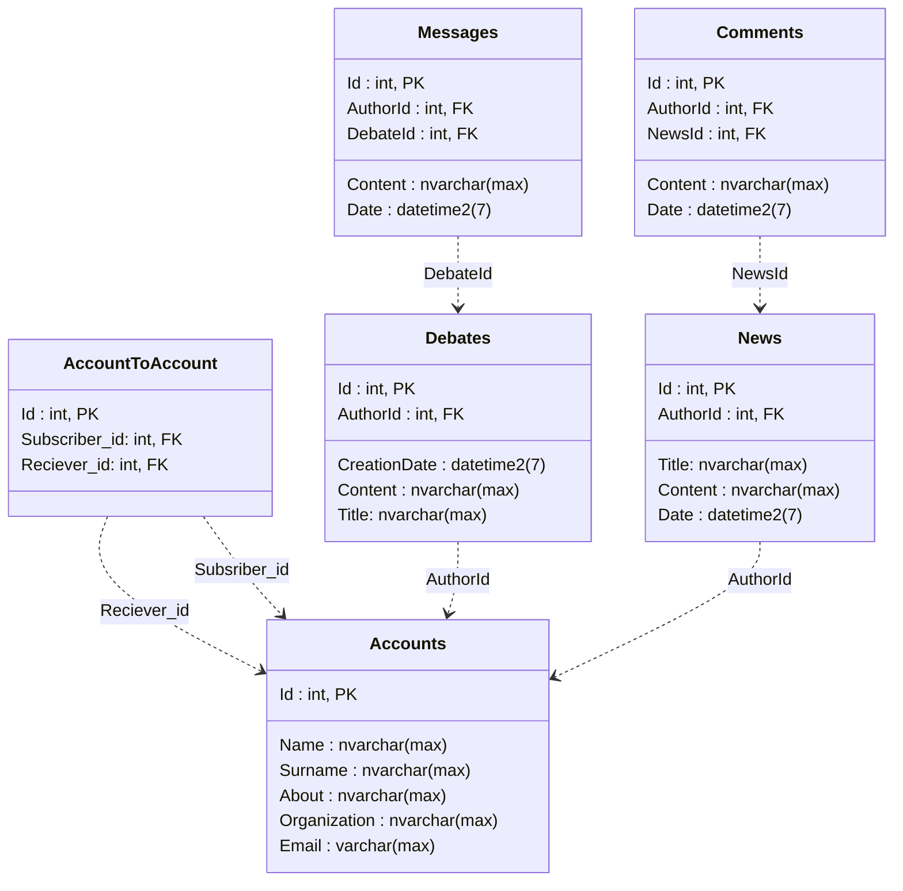

Принцип работы.

Логин и регистрация интуитивно.

У сайта есть две штуки. Дебаты и новости.
Дебаты видят все пользователи всегда, там можно оставлять комментарии, спорить оставлять свое мнение.

Зареганный юзер видит новости только тех людей, на которых он подписан.
Незареганный видит все новости.

Подписаться на пользователя можно зайдя к нему в аккаунт и тыкнув на соовтетстующую кнопку.

Есть возможность редактировать информацию по своему аккаунту. Постить дебаты. Постить новости. Искать в поиске пользователей.



### ***Навигация сайта***
1. ```/news``` - новости
2. ```/news/{PostId}``` - определённая новость с комментариями к нему
3. ```/news/create``` -  создать свою новость. 
4. ```/accounts``` - все аккаунты
5. ```/accounts/{AccountId}``` - профиль конкретного пользователя с списком всех его статей. Возможность подписаться или отписаться. В случае профиля самого юзера возможность отредактировать.
6. ```/accounts/register``` - зарегаться
7. ```/accounts/login``` - залогиниться
8. ```/accounts/logout``` - разлогиниться
9. ```/``` - Страница с приветствием
10. ```/debates``` - все дебаты
11. ```/debates/{DebateId}``` - страница конкретных дебатов. Возможность оставлять свое мнение.
12. ```/debates/create``` - создать дебаты
